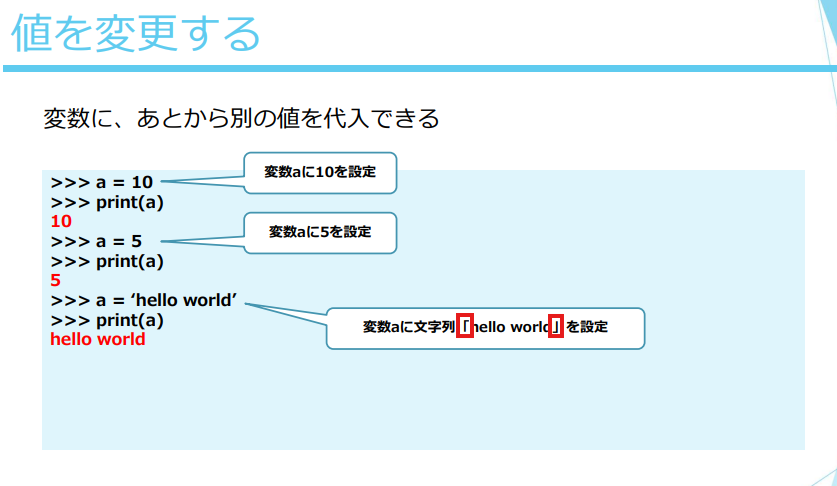
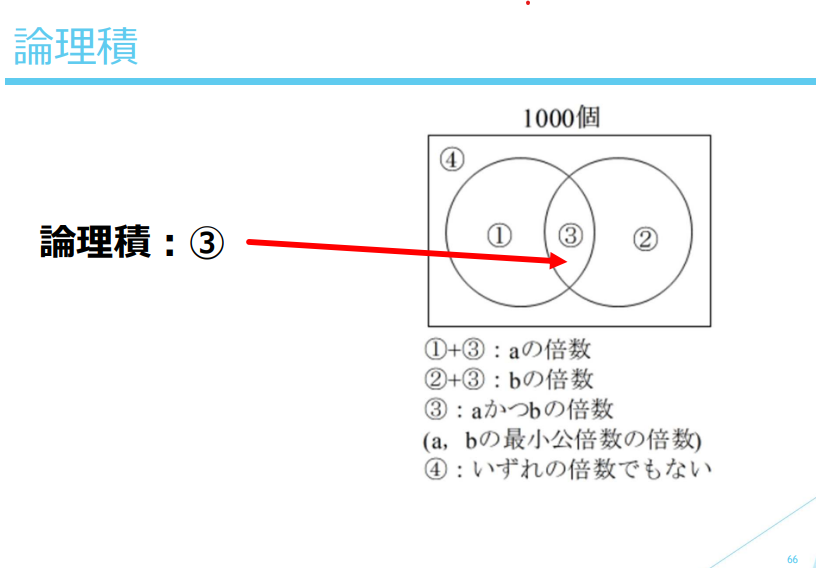

### Python training 

there is a slight misunderstanding from my site, i though it was an array

I hope this is not an array.

1. What the diagram shows

The rectangle represents all 1000 items.

There are two circles, each representing multiples of
a and 𝑏

Circle 1: multiples of 𝑎

Circle 2: multiples of 𝑏

The numbers in the diagram mean:

① → multiples of 𝑎 but not b

② → multiples of 𝑏 but not a

③ → multiples of both a and b (this is the intersection, logical AND, 論理積)

④ → neither multiples of 𝑎 nor 𝑏

2. Explanation of the labels
① + ③ → all multiples of 𝑎

②+③ → all multiples of 𝑏

③ → multiples of both 
𝑎 and b

④
④ → numbers that are not multiples of a or b

So “論理積：③” means the logical AND (intersection) of a and b, i.e., numbers that are multiples of both a and b.
