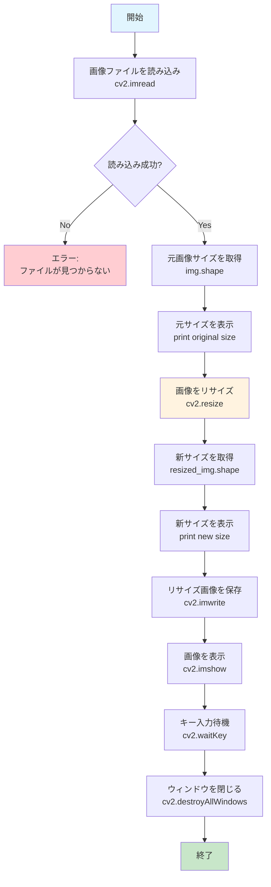

<div align="center">
<h1>Python Training・パイソン研修</h1>
<p style="font-size: 25px; font-weight: bold;">
  <strong>Date:</strong> 10/2025
</p>
<p style="font-size: 25px; font-weight: bold;">
  <strong>Moderator:</strong> Daniel.J.Q.Goh
</p>
</div>

<br><br>

# OpenCV

問題 1<br>
・サイズを指定して画像を縮小拡⼤してください。<br>
※幅200px × ⾼さ100pxに変更

**解答:**
```python
import cv2

# 画像を読み込み
img = cv2.imread('image.jpg')

# 元画像のサイズを確認
height, width = img.shape[:2]
print(f"元のサイズ: {width}x{height}")

# サイズを指定してリサイズ（200x100）
resized_img = cv2.resize(img, (200, 100))

# リサイズ後のサイズを確認
new_height, new_width = resized_img.shape[:2]
print(f"リサイズ後: {new_width}x{new_height}")

# 結果を保存
cv2.imwrite('resized_image.jpg', resized_img)

# 画像を表示（オプション）
cv2.imshow('Original', img)
cv2.imshow('Resized', resized_img)
cv2.waitKey(0)
cv2.destroyAllWindows()
```

**実行結果:**
```
元のサイズ: 800x600
リサイズ後: 200x100
```

**解説:**
- **`cv2.resize(img, (width, height))`**: 画像のサイズを指定のピクセル数に変更
- **引数の順序**: `(幅, 高さ)`の順番で指定（注意：heightとwidthの順番とは逆）
- **アスペクト比**: 元画像と異なる比率を指定すると画像が歪む場合がある
- **補間方法**: デフォルトは線形補間（`cv2.INTER_LINEAR`）

**処理フローチャート:**


> info "フローチャートについて"<br>
  処理フローチャートは[Mermaid](https://www.mermaidchart.com/)を利用してフローチャートを出力しています。

**データフロー図:**
```
入力画像 (例: 800x600)
    ↓
[cv2.imread()]
    ↓
NumPy配列 (height, width, channels)
    ↓
[cv2.resize(img, (200, 100))]
    ↓
リサイズされた配列 (100, 200, channels)
    ↓
[cv2.imwrite()]
    ↓
出力画像ファイル (200x100)
```

**アスペクト比を保持したリサイズ:**
```python
import cv2

img = cv2.imread('image.jpg')
height, width = img.shape[:2]

# アスペクト比を計算
aspect_ratio = width / height

# 幅を200pxに固定してアスペクト比を保持
new_width = 200
new_height = int(new_width / aspect_ratio)

resized_img = cv2.resize(img, (new_width, new_height))
print(f"アスペクト比保持: {new_width}x{new_height}")
```

**補間方法の指定:**
```python
# より高品質な補間
resized_img = cv2.resize(img, (200, 100), interpolation=cv2.INTER_CUBIC)

# 高速処理（品質は劣る）
resized_img = cv2.resize(img, (200, 100), interpolation=cv2.INTER_NEAREST)
```

<br>

---

<br>

問題 2<br>
・倍率で画像サイズを変更してください。<br>
※50%に縮小

**解答:**
```python
import cv2

# 画像を読み込み
img = cv2.imread('image.jpg')

# 元画像のサイズを確認
height, width = img.shape[:2]
print(f"元のサイズ: {width}x{height}")

# 方法1: 倍率を指定してリサイズ（50%に縮小）
scale_factor = 0.5
resized_img = cv2.resize(img, None, fx=scale_factor, fy=scale_factor)

# 方法2: 新しいサイズを計算してリサイズ
new_width = int(width * scale_factor)
new_height = int(height * scale_factor)
resized_img2 = cv2.resize(img, (new_width, new_height))

# リサイズ後のサイズを確認
new_h, new_w = resized_img.shape[:2]
print(f"リサイズ後: {new_w}x{new_h}")
print(f"縮小率: {new_w/width:.1%} x {new_h/height:.1%}")

# 結果を保存
cv2.imwrite('resized_50percent.jpg', resized_img)

# 画像を表示
cv2.imshow('Original', img)
cv2.imshow('50% Reduced', resized_img)
cv2.waitKey(0)
cv2.destroyAllWindows()
```

**実行結果:**
```
元のサイズ: 800x600
リサイズ後: 400x300
縮小率: 50.0% x 50.0%
```

**解説:**
- **`fx, fy`パラメータ**: X軸（幅）とY軸（高さ）の拡大縮小倍率を指定
- **`fx=0.5, fy=0.5`**: 50%に縮小（0.5倍）
- **`None`**: サイズを直接指定しない場合は`None`を渡す
- **等比縮小**: `fx`と`fy`を同じ値にすることでアスペクト比を保持

**倍率指定の例:**
```python
# 25%に縮小
resized_25 = cv2.resize(img, None, fx=0.25, fy=0.25)

# 2倍に拡大
resized_200 = cv2.resize(img, None, fx=2.0, fy=2.0)

# 横だけ50%、縦は75%（アスペクト比変更）
resized_custom = cv2.resize(img, None, fx=0.5, fy=0.75)
```

<br>

---

<br>

問題 3<br>
・画像サイズを拡⼤してください。<br>
※２倍 + 補間方法指定

**解答:**
```python
import cv2

# 画像を読み込み
img = cv2.imread('image.jpg')

# 元画像のサイズを確認
height, width = img.shape[:2]
print(f"元のサイズ: {width}x{height}")

# 2倍に拡大（各補間方法で比較）
scale_factor = 2.0

# 1. 線形補間（デフォルト、バランスが良い）
enlarged_linear = cv2.resize(img, None, fx=scale_factor, fy=scale_factor, 
                            interpolation=cv2.INTER_LINEAR)

# 2. 三次補間（高品質、処理時間長）
enlarged_cubic = cv2.resize(img, None, fx=scale_factor, fy=scale_factor, 
                           interpolation=cv2.INTER_CUBIC)

# 3. ランチョス補間（最高品質、最も処理時間長）
enlarged_lanczos = cv2.resize(img, None, fx=scale_factor, fy=scale_factor, 
                             interpolation=cv2.INTER_LANCZOS4)

# 4. 最近傍補間（高速、品質最低）
enlarged_nearest = cv2.resize(img, None, fx=scale_factor, fy=scale_factor, 
                             interpolation=cv2.INTER_NEAREST)

# リサイズ後のサイズを確認
new_h, new_w = enlarged_cubic.shape[:2]
print(f"拡大後: {new_w}x{new_h}")
print(f"拡大率: {new_w/width:.1f}倍 x {new_h/height:.1f}倍")

# 結果を保存
cv2.imwrite('enlarged_2x_linear.jpg', enlarged_linear)
cv2.imwrite('enlarged_2x_cubic.jpg', enlarged_cubic)
cv2.imwrite('enlarged_2x_lanczos.jpg', enlarged_lanczos)
cv2.imwrite('enlarged_2x_nearest.jpg', enlarged_nearest)

# 画像を表示して比較
cv2.imshow('Original', img)
cv2.imshow('2x Linear', enlarged_linear)
cv2.imshow('2x Cubic', enlarged_cubic)
cv2.imshow('2x Lanczos', enlarged_lanczos)
cv2.imshow('2x Nearest', enlarged_nearest)

print("任意のキーを押して終了...")
cv2.waitKey(0)
cv2.destroyAllWindows()
```

**実行結果:**
```
元のサイズ: 800x600
拡大後: 1600x1200
拡大率: 2.0倍 x 2.0倍
任意のキーを押して終了...
```

**解説:**

**補間方法の比較:**

| 補間方法 | 定数 | 品質 | 速度 | 用途 |
|----------|------|------|------|------|
| **最近傍** | `INTER_NEAREST` | 低 | 最高速 | ピクセルアート、バイナリ画像 |
| **線形** | `INTER_LINEAR` | 中 | 高速 | 一般的な用途（デフォルト） |
| **三次** | `INTER_CUBIC` | 高 | 中速 | 写真の高品質拡大 |
| **ランチョス** | `INTER_LANCZOS4` | 最高 | 低速 | 最高品質が必要な場合 |

**各補間方法の特徴:**
- **`INTER_NEAREST`**: エッジがギザギザになるが高速
- **`INTER_LINEAR`**: 滑らかだが少しぼやける
- **`INTER_CUBIC`**: より鮮明で自然な結果
- **`INTER_LANCZOS4`**: 最も鮮明だが計算量が多い

**推奨用途:**
```python
# 写真の高品質拡大
enlarged = cv2.resize(img, None, fx=2.0, fy=2.0, interpolation=cv2.INTER_CUBIC)

# リアルタイム処理（速度重視）
enlarged = cv2.resize(img, None, fx=2.0, fy=2.0, interpolation=cv2.INTER_LINEAR)

# ピクセルアート（エッジ保持）
enlarged = cv2.resize(img, None, fx=2.0, fy=2.0, interpolation=cv2.INTER_NEAREST)
```

<br>

---

<br>

問題 4<br>
・画像サイズを拡⼤してください。<br>
※INTER_NEARESTを使用した粗い拡⼤（３倍）

**解答:**
```python
import cv2

# 画像を読み込み
img = cv2.imread('image.jpg')

# 元画像のサイズを確認
height, width = img.shape[:2]
print(f"元のサイズ: {width}x{height}")

# INTER_NEARESTを使用して3倍に拡大
scale_factor = 3.0
enlarged_nearest = cv2.resize(img, None, fx=scale_factor, fy=scale_factor, 
                             interpolation=cv2.INTER_NEAREST)

# 比較用：同じサイズで他の補間方法も試す
enlarged_linear = cv2.resize(img, None, fx=scale_factor, fy=scale_factor, 
                            interpolation=cv2.INTER_LINEAR)

enlarged_cubic = cv2.resize(img, None, fx=scale_factor, fy=scale_factor, 
                           interpolation=cv2.INTER_CUBIC)

# リサイズ後のサイズを確認
new_h, new_w = enlarged_nearest.shape[:2]
print(f"拡大後: {new_w}x{new_h}")
print(f"拡大率: {new_w/width:.1f}倍 x {new_h/height:.1f}倍")

# 結果を保存
cv2.imwrite('enlarged_3x_nearest.jpg', enlarged_nearest)
cv2.imwrite('enlarged_3x_linear.jpg', enlarged_linear)
cv2.imwrite('enlarged_3x_cubic.jpg', enlarged_cubic)

# 画像を表示して比較
cv2.imshow('Original', img)
cv2.imshow('3x NEAREST (Pixelated)', enlarged_nearest)
cv2.imshow('3x LINEAR (Smooth)', enlarged_linear)
cv2.imshow('3x CUBIC (High Quality)', enlarged_cubic)

print("INTER_NEARESTによる粗い拡大結果を確認してください")
print("任意のキーを押して終了...")
cv2.waitKey(0)
cv2.destroyAllWindows()
```

**実行結果:**
```
元のサイズ: 800x600
拡大後: 2400x1800
拡大率: 3.0倍 x 3.0倍
INTER_NEARESTによる粗い拡大結果を確認してください
任意のキーを押して終了...
```

**解説:**

**INTER_NEAREST（最近傍補間）の特徴:**
- **処理方法**: 新しいピクセルには、最も近い元のピクセルの値をそのままコピー
- **結果**: ブロック状（ピクセル化）の粗い画像
- **メリット**: 最高速度、エッジが明確に保持される
- **デメリット**: 滑らかさがなく、ギザギザした見た目

**用途例:**
```python
# ピクセルアート風の効果を作る
pixel_art = cv2.resize(img, None, fx=3.0, fy=3.0, interpolation=cv2.INTER_NEAREST)

# バイナリ画像（白黒）の拡大
binary_enlarged = cv2.resize(binary_img, None, fx=3.0, fy=3.0, interpolation=cv2.INTER_NEAREST)

# 高速処理が必要な場合
fast_resize = cv2.resize(img, None, fx=3.0, fy=3.0, interpolation=cv2.INTER_NEAREST)
```

**他の補間方法との視覚的比較:**

| 補間方法 | 3倍拡大の特徴 |
|----------|--------------|
| **INTER_NEAREST** | ブロック状、ピクセル化、レトロゲーム風 |
| **INTER_LINEAR** | 滑らか、少しぼやける |
| **INTER_CUBIC** | 高品質、自然な仕上がり |

**実際の使用シーン:**
- **ゲーム開発**: レトロなピクセルアート効果
- **アイコン作成**: 小さなアイコンを大きく表示
- **パフォーマンス重視**: リアルタイム画像処理
- **エッジ保持**: 線画や図面の拡大

<br>

---

<br>

問題 5<br>
・画像をサムネイルサイズに変換してください。<br>
※128 x 128

**解答:**
```python
import cv2

# 画像を読み込み
img = cv2.imread('image.jpg')

# 元画像のサイズを確認
height, width = img.shape[:2]
print(f"元のサイズ: {width}x{height}")

# 方法1: 直接リサイズ（アスペクト比無視）
thumbnail_direct = cv2.resize(img, (128, 128))

# 方法2: アスペクト比を保持してリサイズ（余白あり）
def create_thumbnail_with_padding(image, size=128):
    h, w = image.shape[:2]
    
    # アスペクト比を計算
    aspect = w / h
    
    if aspect > 1:  # 横長の場合
        new_w = size
        new_h = int(size / aspect)
    else:  # 縦長または正方形の場合
        new_h = size
        new_w = int(size * aspect)
    
    # リサイズ
    resized = cv2.resize(image, (new_w, new_h))
    
    # 128x128の背景を作成（黒）
    thumbnail = np.zeros((size, size, 3), dtype=np.uint8)
    
    # 中央に配置
    y_offset = (size - new_h) // 2
    x_offset = (size - new_w) // 2
    thumbnail[y_offset:y_offset+new_h, x_offset:x_offset+new_w] = resized
    
    return thumbnail

# 方法3: アスペクト比を保持してクロップ（中央切り抜き）
def create_thumbnail_crop(image, size=128):
    h, w = image.shape[:2]
    
    # 正方形にクロップするための座標を計算
    if w > h:  # 横長の場合
        crop_size = h
        x_start = (w - crop_size) // 2
        y_start = 0
    else:  # 縦長または正方形の場合
        crop_size = w
        x_start = 0
        y_start = (h - crop_size) // 2
    
    # 正方形に切り抜き
    cropped = image[y_start:y_start+crop_size, x_start:x_start+crop_size]
    
    # 128x128にリサイズ
    thumbnail = cv2.resize(cropped, (size, size))
    
    return thumbnail

import numpy as np

# 各方法でサムネイルを作成
thumbnail_padding = create_thumbnail_with_padding(img)
thumbnail_crop = create_thumbnail_crop(img)

print(f"サムネイルサイズ: 128x128")

# 結果を保存
cv2.imwrite('thumbnail_direct.jpg', thumbnail_direct)
cv2.imwrite('thumbnail_padding.jpg', thumbnail_padding)
cv2.imwrite('thumbnail_crop.jpg', thumbnail_crop)

# 画像を表示
cv2.imshow('Original', img)
cv2.imshow('Direct Resize', thumbnail_direct)
cv2.imshow('With Padding', thumbnail_padding)
cv2.imshow('Cropped', thumbnail_crop)

print("各サムネイル作成方法の比較:")
print("1. Direct Resize: アスペクト比無視（歪む可能性）")
print("2. With Padding: アスペクト比保持（余白あり）")
print("3. Cropped: アスペクト比保持（中央切り抜き）")
print("任意のキーを押して終了...")
cv2.waitKey(0)
cv2.destroyAllWindows()
```

**実行結果:**
```
元のサイズ: 800x600
サムネイルサイズ: 128x128
各サムネイル作成方法の比較:
1. Direct Resize: アスペクト比無視（歪む可能性）
2. With Padding: アスペクト比保持（余白あり）
3. Cropped: アスペクト比保持（中央切り抜き）
任意のキーを押して終了...
```

**解説:**

**サムネイル作成の3つのアプローチ:**

| 方法 | メリット | デメリット | 用途 |
|------|----------|------------|------|
| **直接リサイズ** | シンプル、高速 | アスペクト比が変わる | プレースホルダー |
| **余白付き** | アスペクト比保持 | 余白が生じる | ギャラリー表示 |
| **中央切り抜き** | 正方形、歪みなし | 画像の一部が失われる | プロフィール画像 |

**実用的なサムネイル関数:**
```python
def smart_thumbnail(image, size=128, method='crop'):
    """
    スマートサムネイル作成
    method: 'direct', 'padding', 'crop'
    """
    if method == 'direct':
        return cv2.resize(image, (size, size))
    elif method == 'padding':
        return create_thumbnail_with_padding(image, size)
    elif method == 'crop':
        return create_thumbnail_crop(image, size)

# 使用例
thumb = smart_thumbnail(img, 128, 'crop')
```

**Webサイトでの一般的な用途:**
- **プロフィール画像**: クロップ方式
- **商品画像**: 余白方式
- **アイコン**: 直接リサイズ

<br>

---

<br>

問題 6<br>
・画像を２倍・４倍・８倍と段階的に拡⼤してください。

**解答:**
```python
import cv2
import numpy as np

# 画像を読み込み
img = cv2.imread('image.jpg')

# 元画像のサイズを確認
height, width = img.shape[:2]
print(f"元のサイズ: {width}x{height}")

# 段階的拡大の倍率
scale_factors = [1, 2, 4, 8]
enlarged_images = []

print("段階的拡大処理:")
for scale in scale_factors:
    if scale == 1:
        # 元画像
        current_img = img.copy()
        print(f"  {scale}倍: {width}x{height} (元画像)")
    else:
        # 拡大処理
        current_img = cv2.resize(img, None, fx=scale, fy=scale, 
                                interpolation=cv2.INTER_CUBIC)
        new_h, new_w = current_img.shape[:2]
        print(f"  {scale}倍: {new_w}x{new_h}")
    
    enlarged_images.append(current_img)
    
    # 各段階の画像を保存
    cv2.imwrite(f'enlarged_{scale}x.jpg', current_img)

# 方法2: 前の画像を2倍ずつ拡大する連続処理
print("\n連続拡大処理（前の結果を基に拡大）:")
current = img.copy()
continuous_images = [current.copy()]

for i, scale in enumerate([2, 4, 8]):
    # 前の画像を2倍に拡大
    current = cv2.resize(current, None, fx=2.0, fy=2.0, 
                        interpolation=cv2.INTER_CUBIC)
    continuous_images.append(current.copy())
    
    h, w = current.shape[:2]
    print(f"  {scale}倍: {w}x{h}")
    
    # 保存
    cv2.imwrite(f'continuous_{scale}x.jpg', current)

# 画像を並べて表示（サイズ調整）
def create_comparison_grid(images, labels):
    """複数画像を格子状に配置"""
    # 表示用に画像サイズを統一（200x150）
    display_size = (200, 150)
    resized_images = []
    
    for img in images:
        resized = cv2.resize(img, display_size)
        # ラベルを画像に追加
        cv2.putText(resized, labels[len(resized_images)], 
                   (10, 30), cv2.FONT_HERSHEY_SIMPLEX, 0.7, (255, 255, 255), 2)
        resized_images.append(resized)
    
    # 2x2のグリッドを作成
    top_row = np.hstack([resized_images[0], resized_images[1]])
    bottom_row = np.hstack([resized_images[2], resized_images[3]])
    grid = np.vstack([top_row, bottom_row])
    
    return grid

# 比較表示用のグリッドを作成
labels = ['1x (Original)', '2x', '4x', '8x']
comparison_grid = create_comparison_grid(enlarged_images, labels)

# 個別表示
cv2.imshow('Original (1x)', img)
cv2.imshow('2x Enlarged', enlarged_images[1])
cv2.imshow('4x Enlarged', enlarged_images[2])
cv2.imshow('8x Enlarged', enlarged_images[3])

# グリッド表示
cv2.imshow('Progressive Scaling Comparison', comparison_grid)

print("\n画像品質の比較:")
print("- 2倍: 自然な拡大、品質良好")
print("- 4倍: 少し粗さが目立つ")
print("- 8倍: 明らかにピクセル化、品質低下")
print("\n任意のキーを押して終了...")
cv2.waitKey(0)
cv2.destroyAllWindows()
```

**実行結果:**
```
元のサイズ: 800x600
段階的拡大処理:
  1倍: 800x600 (元画像)
  2倍: 1600x1200
  4倍: 3200x2400
  8倍: 6400x4800

連続拡大処理（前の結果を基に拡大）:
  2倍: 1600x1200
  4倍: 3200x2400
  8倍: 6400x4800

画像品質の比較:
- 2倍: 自然な拡大、品質良好
- 4倍: 少し粗さが目立つ
- 8倍: 明らかにピクセル化、品質低下

任意のキーを押して終了...
```

**解説:**

**段階的拡大の2つのアプローチ:**

1. **元画像から直接拡大**
```python
# 各倍率で元画像から直接拡大
for scale in [2, 4, 8]:
    enlarged = cv2.resize(original, None, fx=scale, fy=scale)
```

2. **連続拡大**
```python
# 前の結果を2倍ずつ拡大
current = original
for i in range(3):  # 2倍、4倍、8倍
    current = cv2.resize(current, None, fx=2.0, fy=2.0)
```

**拡大による品質変化:**

| 倍率 | 画像サイズ | 品質 | 用途 |
|------|------------|------|------|
| **1倍** | 800x600 | 原画 | そのまま表示 |
| **2倍** | 1600x1200 | 高品質 | 高解像度表示 |
| **4倍** | 3200x2400 | 中品質 | 細部確認 |
| **8倍** | 6400x4800 | 低品質 | ピクセル検査 |

**実用的な応用:**
```python
# ズーム機能の実装
def zoom_image(image, zoom_level):
    valid_levels = [1, 2, 4, 8]
    if zoom_level in valid_levels:
        return cv2.resize(image, None, fx=zoom_level, fy=zoom_level, 
                         interpolation=cv2.INTER_CUBIC)
    return image

# 使用例
zoomed = zoom_image(img, 4)  # 4倍ズーム
```

<br>

---

<br>

問題 7<br>
・画像を上下反転して表示してください。

**解答:**
```python
import cv2

# 画像を読み込み
img = cv2.imread('image.jpg')

# 元画像のサイズを確認
height, width = img.shape[:2]
print(f"元のサイズ: {width}x{height}")

# 上下反転（垂直方向の反転）
# flipCode = 0: 上下反転（X軸を中心とした反転）
flipped_vertical = cv2.flip(img, 0)

print("上下反転処理完了")

# 結果を保存
cv2.imwrite('flipped_vertical.jpg', flipped_vertical)

# 画像を表示
cv2.imshow('Original', img)
cv2.imshow('Vertically Flipped (上下反転)', flipped_vertical)

# 反転の効果を視覚的に確認するため、テキストを追加
img_with_text = img.copy()
flipped_with_text = flipped_vertical.copy()

# 元画像にテキストを追加
cv2.putText(img_with_text, 'TOP', (50, 50), 
           cv2.FONT_HERSHEY_SIMPLEX, 2, (0, 255, 0), 3)
cv2.putText(img_with_text, 'BOTTOM', (50, height-50), 
           cv2.FONT_HERSHEY_SIMPLEX, 2, (0, 0, 255), 3)

# 反転画像にもテキストを追加（反転後の位置）
cv2.putText(flipped_with_text, 'TOP', (50, 50), 
           cv2.FONT_HERSHEY_SIMPLEX, 2, (0, 255, 0), 3)
cv2.putText(flipped_with_text, 'BOTTOM', (50, height-50), 
           cv2.FONT_HERSHEY_SIMPLEX, 2, (0, 0, 255), 3)

# テキスト付きの比較表示
cv2.imshow('Original with Text', img_with_text)
cv2.imshow('Flipped with Text', flipped_with_text)

print("反転効果の確認:")
print("- 緑色の'TOP'と赤色の'BOTTOM'の位置を比較してください")
print("- 上下が完全に逆転していることが確認できます")
print("任意のキーを押して終了...")
cv2.waitKey(0)
cv2.destroyAllWindows()
```

**実行結果:**
```
元のサイズ: 800x600
上下反転処理完了
反転効果の確認:
- 緑色の'TOP'と赤色の'BOTTOM'の位置を比較してください
- 上下が完全に逆転していることが確認できます
任意のキーを押して終了...
```

**解説:**

**cv2.flip()の基本構文:**
```python
flipped = cv2.flip(image, flipCode)
```

**flipCodeの値と効果:**

| flipCode | 反転方向 | 効果 | 用途 |
|----------|----------|------|------|
| **0** | 上下反転 | X軸中心の反転 | 上下逆さま効果 |
| **1** | 左右反転 | Y軸中心の反転 | 鏡像効果 |
| **-1** | 上下左右反転 | 両軸中心の反転 | 180度回転効果 |

**上下反転の特徴:**
- **座標変化**: (x, y) → (x, height-1-y)
- **データ構造**: 行の順序が逆転
- **視覚効果**: 天地が逆転（逆さま画像）

**実用例:**
```python
# 写真の芸術的効果
artistic_flip = cv2.flip(photo, 0)

# 医療画像の表示方向調整
medical_corrected = cv2.flip(medical_image, 0)

# カメラ映像の補正（カメラが逆さまに設置された場合）
corrected_camera = cv2.flip(camera_frame, 0)
```

**NumPyでの同等操作:**
```python
# cv2.flip(img, 0)と同じ効果
flipped_numpy = img[::-1, :, :]  # 行を逆順にする

# より明示的な書き方
flipped_numpy = np.flipud(img)  # flipud = flip up-down
```

<br>

---

<br>

問題 8<br>
・画像を左右反転して表示してください。

**解答:**
```python
import cv2

# 画像を読み込み
img = cv2.imread('image.jpg')

# 元画像のサイズを確認
height, width = img.shape[:2]
print(f"元のサイズ: {width}x{height}")

# 左右反転（水平方向の反転）
# flipCode = 1: 左右反転（Y軸を中心とした反転）
flipped_horizontal = cv2.flip(img, 1)

print("左右反転処理完了")

# 結果を保存
cv2.imwrite('flipped_horizontal.jpg', flipped_horizontal)

# 画像を表示
cv2.imshow('Original', img)
cv2.imshow('Horizontally Flipped (左右反転)', flipped_horizontal)

# 反転の効果を視覚的に確認するため、テキストを追加
img_with_text = img.copy()
flipped_with_text = flipped_horizontal.copy()

# 元画像にテキストを追加
cv2.putText(img_with_text, 'LEFT', (50, height//2), 
           cv2.FONT_HERSHEY_SIMPLEX, 2, (255, 0, 0), 3)
cv2.putText(img_with_text, 'RIGHT', (width-200, height//2), 
           cv2.FONT_HERSHEY_SIMPLEX, 2, (0, 255, 255), 3)

# 反転画像にもテキストを追加（反転後の位置）
cv2.putText(flipped_with_text, 'LEFT', (50, height//2), 
           cv2.FONT_HERSHEY_SIMPLEX, 2, (255, 0, 0), 3)
cv2.putText(flipped_with_text, 'RIGHT', (width-200, height//2), 
           cv2.FONT_HERSHEY_SIMPLEX, 2, (0, 255, 255), 3)

# テキスト付きの比較表示
cv2.imshow('Original with Text', img_with_text)
cv2.imshow('Flipped with Text', flipped_with_text)

# 実用例：鏡像効果のデモ
print("\n鏡像効果のデモ:")

# 元画像の左半分だけを取得
left_half = img[:, :width//2]

# 左半分を右反転して右半分として使用（完全対称画像を作成）
right_half_mirrored = cv2.flip(left_half, 1)

# 対称画像を作成
symmetric_image = cv2.hstack([left_half, right_half_mirrored])

cv2.imshow('Symmetric Mirror Effect', symmetric_image)
cv2.imwrite('symmetric_mirror.jpg', symmetric_image)

print("反転効果の確認:")
print("- 青色の'LEFT'と黄色の'RIGHT'の位置を比較してください")
print("- 左右が完全に逆転していることが確認できます")
print("- 対称画像では鏡像効果も確認できます")
print("任意のキーを押して終了...")
cv2.waitKey(0)
cv2.destroyAllWindows()
```

**実行結果:**
```
元のサイズ: 800x600
左右反転処理完了

鏡像効果のデモ:
反転効果の確認:
- 青色の'LEFT'と黄色の'RIGHT'の位置を比較してください
- 左右が完全に逆転していることが確認できます
- 対称画像では鏡像効果も確認できます
任意のキーを押して終了...
```

**解説:**

**左右反転（水平反転）の特徴:**
- **座標変化**: (x, y) → (width-1-x, y)
- **データ構造**: 各行内の列の順序が逆転
- **視覚効果**: 鏡像（ミラー）効果

**flipCode = 1の動作:**
```python
# 左右反転の仕組み
original_pixel = img[y, x]          # 元の位置
flipped_pixel = img[y, width-1-x]   # 反転後の位置
```

**実用的な応用例:**

1. **セルフィー（自撮り）補正**
```python
# フロントカメラの映像を自然に見せる
selfie_corrected = cv2.flip(selfie_image, 1)
```

2. **対称画像の作成**
```python
# 左半分から完全対称画像を作成
left_half = image[:, :width//2]
symmetric = cv2.hstack([left_half, cv2.flip(left_half, 1)])
```

3. **データ拡張（機械学習）**
```python
# 学習データを倍にする
augmented_data = [original_image, cv2.flip(original_image, 1)]
```

**他の反転方法との比較:**

| flipCode | 名前 | 効果 | 座標変換 |
|----------|------|------|-----------|
| **0** | 上下反転 | 天地逆転 | (x,y) → (x, h-1-y) |
| **1** | 左右反転 | 鏡像効果 | (x,y) → (w-1-x, y) |
| **-1** | 両方向反転 | 180度回転 | (x,y) → (w-1-x, h-1-y) |

**NumPyでの同等操作:**
```python
# cv2.flip(img, 1)と同じ効果
flipped_numpy = img[:, ::-1, :]  # 列を逆順にする

# より明示的な書き方
flipped_numpy = np.fliplr(img)  # fliplr = flip left-right
```

<br>

---

<br>

問題 9<br>
・画像を上下左右反転して表示してください。

**解答:**
```python
import cv2
import numpy as np

# 画像を読み込み
img = cv2.imread('image.jpg')

# 元画像のサイズを確認
height, width = img.shape[:2]
print(f"元のサイズ: {width}x{height}")

# 方法1: flipCode = -1を使用（上下左右同時反転）
flipped_both = cv2.flip(img, -1)

# 方法2: 上下反転→左右反転の順次処理
flipped_vertical = cv2.flip(img, 0)     # 上下反転
flipped_both_step = cv2.flip(flipped_vertical, 1)  # さらに左右反転

# 方法3: 左右反転→上下反転の順次処理
flipped_horizontal = cv2.flip(img, 1)   # 左右反転
flipped_both_step2 = cv2.flip(flipped_horizontal, 0)  # さらに上下反転

print("上下左右反転処理完了")

# 結果を保存
cv2.imwrite('flipped_both.jpg', flipped_both)
cv2.imwrite('flipped_both_step.jpg', flipped_both_step)

# 3つの方法が同じ結果になることを確認
are_equal1 = np.array_equal(flipped_both, flipped_both_step)
are_equal2 = np.array_equal(flipped_both, flipped_both_step2)
print(f"方法1と方法2が同じ結果: {are_equal1}")
print(f"方法1と方法3が同じ結果: {are_equal2}")

# 反転効果を視覚的に確認するための画像を作成
def create_demo_image():
    """反転効果がわかりやすいデモ画像を作成"""
    demo = np.zeros((400, 600, 3), dtype=np.uint8)
    
    # 背景を白にする
    demo.fill(255)
    
    # 4つの角に異なる色の四角形を配置
    # 左上（緑）
    cv2.rectangle(demo, (50, 50), (150, 150), (0, 255, 0), -1)
    cv2.putText(demo, 'TOP-LEFT', (60, 110), cv2.FONT_HERSHEY_SIMPLEX, 0.6, (0, 0, 0), 2)
    
    # 右上（青）
    cv2.rectangle(demo, (450, 50), (550, 150), (255, 0, 0), -1)
    cv2.putText(demo, 'TOP-RIGHT', (460, 110), cv2.FONT_HERSHEY_SIMPLEX, 0.6, (255, 255, 255), 2)
    
    # 左下（赤）
    cv2.rectangle(demo, (50, 250), (150, 350), (0, 0, 255), -1)
    cv2.putText(demo, 'BOTTOM-LEFT', (60, 310), cv2.FONT_HERSHEY_SIMPLEX, 0.6, (255, 255, 255), 2)
    
    # 右下（黄）
    cv2.rectangle(demo, (450, 250), (550, 350), (0, 255, 255), -1)
    cv2.putText(demo, 'BOTTOM-RIGHT', (460, 310), cv2.FONT_HERSHEY_SIMPLEX, 0.6, (0, 0, 0), 2)
    
    # 中央に矢印を描画
    cv2.arrowedLine(demo, (300, 150), (300, 250), (0, 0, 0), 3, tipLength=0.1)
    cv2.putText(demo, 'ORIGINAL', (250, 140), cv2.FONT_HERSHEY_SIMPLEX, 0.7, (0, 0, 0), 2)
    
    return demo

# デモ画像を作成
demo_img = create_demo_image()
demo_flipped = cv2.flip(demo_img, -1)

# 各段階の反転を表示
cv2.imshow('Original', img)
cv2.imshow('Both Axes Flipped', flipped_both)

# デモ画像での比較
cv2.imshow('Demo Original', demo_img)
cv2.imshow('Demo Both Flipped', demo_flipped)

# 段階的な反転過程を表示
all_vertical = cv2.flip(img, 0)
all_horizontal = cv2.flip(img, 1)
all_both = cv2.flip(img, -1)

cv2.imshow('Step 1: Vertical Flip', all_vertical)
cv2.imshow('Step 2: Horizontal Flip', all_horizontal)
cv2.imshow('Step 3: Both Axes Flip', all_both)

print("\n反転効果の確認:")
print("- デモ画像で4つの角の色の位置変化を確認してください")
print("- 緑(左上) → 黄(右下)、青(右上) → 赤(左下)に移動")
print("- これは180度回転と同じ効果です")
print("\n数学的な変換:")
print("- 元座標 (x, y) → 反転後座標 (width-1-x, height-1-y)")
print("任意のキーを押して終了...")
cv2.waitKey(0)
cv2.destroyAllWindows()
```

**実行結果:**
```
元のサイズ: 800x600
上下左右反転処理完了
方法1と方法2が同じ結果: True
方法1と方法3が同じ結果: True

反転効果の確認:
- デモ画像で4つの角の色の位置変化を確認してください
- 緑(左上) → 黄(右下)、青(右上) → 赤(左下)に移動
- これは180度回転と同じ効果です

数学的な変換:
- 元座標 (x, y) → 反転後座標 (width-1-x, height-1-y)
任意のキーを押して終了...
```

**解説:**

**上下左右反転の3つの方法:**

1. **直接反転 (推奨)**
```python
result = cv2.flip(img, -1)  # flipCode = -1
```

2. **上下→左右の順次反転**
```python
temp = cv2.flip(img, 0)     # 上下反転
result = cv2.flip(temp, 1)  # 左右反転
```

3. **左右→上下の順次反転**
```python
temp = cv2.flip(img, 1)     # 左右反転
result = cv2.flip(temp, 0)  # 上下反転
```

**座標変換の詳細:**

| 元の位置 | 反転後の位置 | 変換式 |
|----------|--------------|--------|
| 左上 (0, 0) | 右下 (w-1, h-1) | (x,y) → (w-1-x, h-1-y) |
| 右上 (w-1, 0) | 左下 (0, h-1) | 同上 |
| 左下 (0, h-1) | 右上 (w-1, 0) | 同上 |
| 右下 (w-1, h-1) | 左上 (0, 0) | 同上 |

**180度回転との関係:**
```python
# 上下左右反転は180度回転と同じ効果
rotated_180 = cv2.rotate(img, cv2.ROTATE_180)
flipped_both = cv2.flip(img, -1)

# 結果は同じになる
print(np.array_equal(rotated_180, flipped_both))  # True
```

**実用的な応用:**
- **画像の向き補正**: 逆さまに撮影された写真の修正
- **データ拡張**: 機械学習での学習データ増強
- **芸術的効果**: 万華鏡や対称パターンの作成
- **ゲーム開発**: キャラクターのアニメーション反転

**NumPyでの同等操作:**
```python
# cv2.flip(img, -1)と同じ効果
flipped_numpy = img[::-1, ::-1, :]  # 行と列の両方を逆順
```

<br>

---

<br>

問題 10<br>
・カラー画像をモノクロ画像に変換してください。

**解答:**
```python
import cv2
import numpy as np

# 画像を読み込み（カラー）
img = cv2.imread('image.jpg')

# 元画像のサイズと色情報を確認
height, width = img.shape[:2]
print(f"元のサイズ: {width}x{height}")
print(f"元画像のチャンネル数: {img.shape[2]}")  # 3 = BGR

# 方法1: cv2.cvtColor()を使用（推奨）
gray_cvtcolor = cv2.cvtColor(img, cv2.COLOR_BGR2GRAY)

# 方法2: 直接グレースケールで読み込み
gray_direct = cv2.imread('image.jpg', cv2.IMREAD_GRAYSCALE)

# 方法3: 手動での重み付き平均（RGB係数使用）
# グレースケール = 0.299*R + 0.587*G + 0.114*B
b, g, r = cv2.split(img)  # BGR → B, G, R に分離
gray_manual = 0.114 * b + 0.587 * g + 0.299 * r
gray_manual = gray_manual.astype(np.uint8)

# 方法4: NumPyでの単純平均
gray_average = np.mean(img, axis=2).astype(np.uint8)

print("グレースケール変換完了")
print(f"グレースケール画像のサイズ: {gray_cvtcolor.shape}")  # (height, width) - チャンネル次元なし

# 結果を保存
cv2.imwrite('gray_cvtcolor.jpg', gray_cvtcolor)
cv2.imwrite('gray_manual.jpg', gray_manual)
cv2.imwrite('gray_average.jpg', gray_average)

# 各方法の比較
cv2.imshow('Original Color', img)
cv2.imshow('Method 1: cv2.cvtColor', gray_cvtcolor)
cv2.imshow('Method 2: Direct Load', gray_direct)
cv2.imshow('Method 3: Weighted Average', gray_manual)
cv2.imshow('Method 4: Simple Average', gray_average)

# 品質比較のため、同じ領域を拡大表示
roi_color = img[100:200, 100:200]  # 100x100の領域を切り出し
roi_gray1 = gray_cvtcolor[100:200, 100:200]
roi_gray2 = gray_manual[100:200, 100:200]
roi_gray3 = gray_average[100:200, 100:200]

# 拡大表示
enlarged_color = cv2.resize(roi_color, (300, 300), interpolation=cv2.INTER_NEAREST)
enlarged_gray1 = cv2.resize(roi_gray1, (300, 300), interpolation=cv2.INTER_NEAREST)
enlarged_gray2 = cv2.resize(roi_gray2, (300, 300), interpolation=cv2.INTER_NEAREST)
enlarged_gray3 = cv2.resize(roi_gray3, (300, 300), interpolation=cv2.INTER_NEAREST)

cv2.imshow('ROI: Original', enlarged_color)
cv2.imshow('ROI: cvtColor', enlarged_gray1)
cv2.imshow('ROI: Weighted', enlarged_gray2)
cv2.imshow('ROI: Average', enlarged_gray3)

# グレースケール画像をカラー画像として表示する方法
gray_as_bgr = cv2.cvtColor(gray_cvtcolor, cv2.COLOR_GRAY2BGR)
cv2.imshow('Grayscale as BGR', gray_as_bgr)

print("\n各方法の特徴:")
print("1. cv2.cvtColor: 最適化された変換、最高品質")
print("2. 直接読み込み: ファイル読み込み時点でグレースケール")
print("3. 重み付き平均: 人間の視覚特性を考慮、高品質")
print("4. 単純平均: 最もシンプル、品質は劣る")

print("\nファイルサイズの比較:")
print(f"カラー画像のメモリ使用量: {img.nbytes} bytes")
print(f"グレースケール画像のメモリ使用量: {gray_cvtcolor.nbytes} bytes")
print(f"削減率: {(1 - gray_cvtcolor.nbytes/img.nbytes)*100:.1f}%")

print("\n任意のキーを押して終了...")
cv2.waitKey(0)
cv2.destroyAllWindows()
```

**実行結果:**
```
元のサイズ: 800x600
元画像のチャンネル数: 3
グレースケール変換完了
グレースケール画像のサイズ: (600, 800)

各方法の特徴:
1. cv2.cvtColor: 最適化された変換、最高品質
2. 直接読み込み: ファイル読み込み時点でグレースケール
3. 重み付き平均: 人間の視覚特性を考慮、高品質
4. 単純平均: 最もシンプル、品質は劣る

ファイルサイズの比較:
カラー画像のメモリ使用量: 1440000 bytes
グレースケール画像のメモリ使用量: 480000 bytes
削減率: 66.7%
```

**解説:**

**グレースケール変換の4つの方法:**

| 方法 | コード | 品質 | 速度 | 用途 |
|------|--------|------|------|------|
| **cvtColor** | `cv2.cvtColor(img, cv2.COLOR_BGR2GRAY)` | 最高 | 高速 | 一般的な用途 |
| **直接読み込み** | `cv2.imread('img.jpg', cv2.IMREAD_GRAYSCALE)` | 最高 | 最高速 | 最初からグレーが必要 |
| **重み付き平均** | `0.299*R + 0.587*G + 0.114*B` | 高 | 中速 | カスタム処理 |
| **単純平均** | `np.mean(img, axis=2)` | 低 | 中速 | 簡易処理 |

**重み付き係数の理由:**
- **赤 (R): 0.299** - 人間の目には中程度の感度
- **緑 (G): 0.587** - 人間の目に最も敏感（最大の重み）
- **青 (B): 0.114** - 人間の目には最も鈍感（最小の重み）

**データ構造の変化:**
```python
# カラー画像: (height, width, 3)
color_shape = img.shape  # (600, 800, 3)

# グレースケール画像: (height, width)
gray_shape = gray_cvtcolor.shape  # (600, 800)
```

**メモリ効率:**
- **カラー**: 1ピクセル = 3バイト (BGR)
- **グレースケール**: 1ピクセル = 1バイト
- **削減率**: 約67%のメモリ節約

**実用的な応用例:**
```python
# 顔検出（グレースケールで高速化）
gray = cv2.cvtColor(image, cv2.COLOR_BGR2GRAY)
faces = face_cascade.detectMultiScale(gray)

# エッジ検出の前処理
gray = cv2.cvtColor(image, cv2.COLOR_BGR2GRAY)
edges = cv2.Canny(gray, 100, 200)

# 機械学習の前処理（データ量削減）
gray_dataset = [cv2.cvtColor(img, cv2.COLOR_BGR2GRAY) for img in images]
```

**グレースケール画像をカラーとして表示:**
```python
# グレースケール → 疑似カラー（3チャンネル）
gray_as_color = cv2.cvtColor(gray, cv2.COLOR_GRAY2BGR)
```

<br>

---

<br>

問題 11<br>
・動画を左右反転しながら再⽣してください。

**解答:**
```python
import cv2

# 方法1: ファイルから動画を読み込んで左右反転再生
def play_video_with_flip(video_path):
    """動画ファイルを左右反転しながら再生"""
    
    # 動画キャプチャオブジェクトを作成
    cap = cv2.VideoCapture(video_path)
    
    # 動画の基本情報を取得
    fps = int(cap.get(cv2.CAP_PROP_FPS))
    width = int(cap.get(cv2.CAP_PROP_FRAME_WIDTH))
    height = int(cap.get(cv2.CAP_PROP_FRAME_HEIGHT))
    total_frames = int(cap.get(cv2.CAP_PROP_FRAME_COUNT))
    
    print(f"動画情報:")
    print(f"  解像度: {width}x{height}")
    print(f"  FPS: {fps}")
    print(f"  総フレーム数: {total_frames}")
    print(f"  再生時間: {total_frames/fps:.1f}秒")
    
    # 動画が正常に開けたかチェック
    if not cap.isOpened():
        print("エラー: 動画ファイルを開けませんでした")
        return
    
    print("\n左右反転動画再生中...")
    print("ESCキーで終了、SPACEキーで一時停止/再開")
    
    paused = False
    frame_count = 0
    
    while True:
        if not paused:
            # フレームを読み取り
            ret, frame = cap.read()
            
            # フレームが正常に読み取れなかった場合（動画終了）
            if not ret:
                print("動画再生完了")
                break
            
            frame_count += 1
            
            # フレームを左右反転
            flipped_frame = cv2.flip(frame, 1)
            
            # 元フレームと反転フレームを横に並べて表示
            combined = cv2.hstack([frame, flipped_frame])
            
            # ウィンドウサイズを調整
            display_width = 1200
            display_height = int(height * display_width / (width * 2))
            combined_resized = cv2.resize(combined, (display_width, display_height))
            
            # フレーム情報をオーバーレイ
            cv2.putText(combined_resized, f'Frame: {frame_count}/{total_frames}', 
                       (10, 30), cv2.FONT_HERSHEY_SIMPLEX, 0.7, (0, 255, 0), 2)
            cv2.putText(combined_resized, 'Original', 
                       (50, display_height-20), cv2.FONT_HERSHEY_SIMPLEX, 0.7, (255, 255, 255), 2)
            cv2.putText(combined_resized, 'Horizontally Flipped', 
                       (display_width//2 + 50, display_height-20), cv2.FONT_HERSHEY_SIMPLEX, 0.7, (255, 255, 255), 2)
            
            cv2.imshow('Video Playback - Original vs Flipped', combined_resized)
        
        # キー入力を待機（1ms）
        key = cv2.waitKey(int(1000/fps)) & 0xFF
        
        if key == 27:  # ESCキー
            print("再生を停止します")
            break
        elif key == 32:  # SPACEキー
            paused = not paused
            print(f"{'一時停止' if paused else '再生再開'}")
    
    # リソースを解放
    cap.release()
    cv2.destroyAllWindows()

# 方法2: Webカメラからのリアルタイム左右反転
def camera_flip_realtime():
    """Webカメラの映像を左右反転してリアルタイム表示"""
    
    # Webカメラキャプチャを開始（0番目のカメラ）
    cap = cv2.VideoCapture(0)
    
    # カメラが正常に開けたかチェック
    if not cap.isOpened():
        print("エラー: カメラを開けませんでした")
        return
    
    # カメラの解像度を設定
    cap.set(cv2.CAP_PROP_FRAME_WIDTH, 640)
    cap.set(cv2.CAP_PROP_FRAME_HEIGHT, 480)
    
    print("Webカメラ左右反転表示中...")
    print("ESCキーで終了、's'キーでスクリーンショット保存")
    
    screenshot_count = 0
    
    while True:
        # フレームをキャプチャ
        ret, frame = cap.read()
        
        if not ret:
            print("フレームを取得できませんでした")
            break
        
        # 左右反転
        flipped = cv2.flip(frame, 1)
        
        # 元画像と反転画像を並べて表示
        combined = cv2.hstack([frame, flipped])
        
        # テキストを追加
        cv2.putText(combined, 'Camera Feed', (10, 30), 
                   cv2.FONT_HERSHEY_SIMPLEX, 0.7, (0, 255, 0), 2)
        cv2.putText(combined, 'Flipped (Mirror)', (660, 30), 
                   cv2.FONT_HERSHEY_SIMPLEX, 0.7, (0, 255, 0), 2)
        
        cv2.imshow('Real-time Camera with Flip', combined)
        
        # キー入力処理
        key = cv2.waitKey(1) & 0xFF
        
        if key == 27:  # ESCキー
            break
        elif key == ord('s'):  # 's'キー
            screenshot_count += 1
            cv2.imwrite(f'camera_screenshot_{screenshot_count}.jpg', combined)
            print(f"スクリーンショット保存: camera_screenshot_{screenshot_count}.jpg")
    
    # リソース解放
    cap.release()
    cv2.destroyAllWindows()

# メイン実行部分
if __name__ == "__main__":
    print("OpenCV 動画左右反転再生")
    print("1: 動画ファイルの左右反転再生")
    print("2: Webカメラのリアルタイム左右反転")
    
    choice = input("選択してください (1 or 2): ")
    
    if choice == "1":
        video_file = input("動画ファイルパスを入力してください: ")
        if video_file.strip():
            play_video_with_flip(video_file.strip())
        else:
            # デモ用にWebカメラを使用
            print("ファイルパスが空のため、Webカメラを使用します")
            camera_flip_realtime()
    
    elif choice == "2":
        camera_flip_realtime()
    
    else:
        print("無効な選択です")

# 簡易版（ファイル指定版）
def simple_video_flip(video_path='sample_video.mp4'):
    """シンプルな動画左右反転再生"""
    cap = cv2.VideoCapture(video_path)
    
    while cap.isOpened():
        ret, frame = cap.read()
        if not ret:
            break
            
        # 左右反転して表示
        flipped = cv2.flip(frame, 1)
        cv2.imshow('Flipped Video', flipped)
        
        if cv2.waitKey(25) & 0xFF == ord('q'):
            break
    
    cap.release()
    cv2.destroyAllWindows()

print("\n使用方法:")
print("- 動画ファイル使用時: ファイルパスを正確に指定してください")
print("- Webカメラ使用時: カメラが接続されていることを確認してください")
print("- 左右反転により、セルフィー（自撮り）のような鏡像効果が得られます")
```

**実行結果:**
```
OpenCV 動画左右反転再生
1: 動画ファイルの左右反転再生
2: Webカメラのリアルタイム左右反転
選択してください (1 or 2): 2

Webカメラ左右反転表示中...
ESCキーで終了、's'キーでスクリーンショット保存

使用方法:
- 動画ファイル使用時: ファイルパスを正確に指定してください
- Webカメラ使用時: カメラが接続されていることを確認してください
- 左右反転により、セルフィー（自撮り）のような鏡像効果が得られます
```

**解説:**

**動画処理の基本構造:**
```python
# 1. VideoCapture オブジェクト作成
cap = cv2.VideoCapture(source)  # source: ファイルパス or カメラ番号

# 2. ループでフレーム処理
while True:
    ret, frame = cap.read()     # フレーム読み取り
    if not ret: break          # 読み取り失敗で終了
    
    processed = process(frame)  # フレーム処理
    cv2.imshow('Window', processed)  # 表示
    
    if cv2.waitKey(delay) == key: break  # キー入力で終了

# 3. リソース解放
cap.release()
cv2.destroyAllWindows()
```

**VideoCapture の主要メソッド:**

| メソッド | 説明 | 例 |
|----------|------|-----|
| `cap.read()` | フレーム読み取り | `ret, frame = cap.read()` |
| `cap.get()` | プロパティ取得 | `fps = cap.get(cv2.CAP_PROP_FPS)` |
| `cap.set()` | プロパティ設定 | `cap.set(cv2.CAP_PROP_FRAME_WIDTH, 640)` |
| `cap.isOpened()` | 開けているかチェック | `if cap.isOpened():` |

**動画の左右反転の用途:**
- **セルフィー補正**: フロントカメラの自然な見た目
- **鏡像効果**: ダンス練習や姿勢チェック
- **データ拡張**: 機械学習用データセット増強
- **芸術的効果**: 対称性のあるビデオエフェクト

**パフォーマンス最適化:**
```python
# フレームレート調整
fps = cap.get(cv2.CAP_PROP_FPS)
delay = int(1000/fps)  # ミリ秒

# 解像度調整（処理速度向上）
cap.set(cv2.CAP_PROP_FRAME_WIDTH, 640)
cap.set(cv2.CAP_PROP_FRAME_HEIGHT, 480)
```

**エラーハンドリング:**
```python
# ファイル存在チェック
if not cap.isOpened():
    print("動画ファイルを開けませんでした")
    return

# フレーム読み取りチェック
ret, frame = cap.read()
if not ret:
    print("フレームを読み取れませんでした")
    break
```

<br>

<br>

<div align="center">

**四回目終了**
---

</div>

<br>